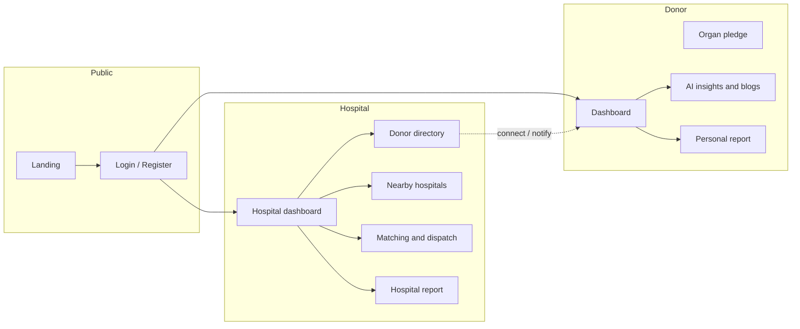

# LifeLink

City-based **blood and organ allocation** for donors and hospitals: pledges, emergency matching, hospital-to-hospital transfers, and hospital-to-donor connections.


*A living donation takes under an hour. A posthumous organ pledge can save up to eight people.*

---

## What it is

LifeLink is a React (Vite + TypeScript) web app. Individuals register as donors, log blood donations, and pledge organs after death. Hospitals raise emergency requests, run matching, dispatch, and **browse who is available today and which organs each person has pledged**.

| Role | What they do |
|------|----------------|
| **Individual / donor** | Register, pledge organs, log blood, see AI insights & education, print a **personal** contribution report |
| **Hospital** | Emergency requests, matching, nearby stock transfers, **donor directory**, hospital request/delivery reports |

---

## Product map



### Hospital ↔ donor

Hospitals open **Donor Directory**, filter by blood group or pledged organ, and **Connect**. The donor sees that approach in their match feed and personal report (“hospitals that approached your organ pledge this month”).

---

## Screens at a glance

**Landing** — no demo switcher. Photography and a pledge CTA instead of a live simulation panel.


**Donor report** — only that person’s logs: blood donations, organs pledged, hospital approaches, match history.

**Hospital report** — hospital name, requests made, inbound approvals from other hospitals, time the request was made, organ/unit delivery time.

**Auth** — email/password register and login only (no one-click demo accounts).

---

## Stack

- **Vite 5 + React 18 + TypeScript**
- **Tailwind CSS** + Framer Motion + Recharts
- **Firebase Auth + Firestore** (falls back to in-memory data if the network is blocked)
- Deploy as a static SPA on **Vercel**

---

## Local setup

```bash
npm install
npm run dev
```

Open the URL Vite prints (usually `http://localhost:5173`).

```bash
npm run build
npm run preview
```

---

## Deploy on Vercel

This repo is already a Vite app. `vercel.json` rewrites all routes to `index.html` so React Router paths (`/dashboard`, `/reports`, …) work after refresh.

1. Push the project to GitHub.
2. [Import](https://vercel.com/new) the repo in Vercel.
3. Framework: **Vite** (auto). Build: `npm run build`. Output: `dist`.
4. Deploy.

Firebase keys currently live in `src/lib/firebase.ts`. For production you can later move them to Vercel env vars (`VITE_FIREBASE_*`) and read them in that file.

---

## Main routes

| Path | Who |
|------|-----|
| `/` | Public landing |
| `/auth` | Login / register |
| `/dashboard` | Donor home |
| `/organ-pledge` | Update posthumous organs |
| `/recommendations` | Insights + donation blogs (donor) |
| `/reports` | Role-specific reports |
| `/hospital-dashboard` | Hospital home |
| `/donor-directory` | Connect to donors & pledges |
| `/create-request` | Emergency request |
| `/matching-engine` | Compatibility ranking |
| `/dispatch` | Cold-chain / dispatch view |
| `/nearby-hospitals` | Cross-hospital stock |
| `/transparency` | Hash log |

---

## Matching (high level)

Scores combine **blood compatibility (~50%)**, **proximity (~30%)**, and **reliability (~20%)**. Hospitals still confirm clinical eligibility offline; the app does not replace transplant law or death certification.

---

## Team note

Built as **LifeLink** (hackathon lineage: InnovationHackathon-StrawHats). For questions about allocation ethics, treat this as a demonstration of workflow — not a licensed transplant system.
